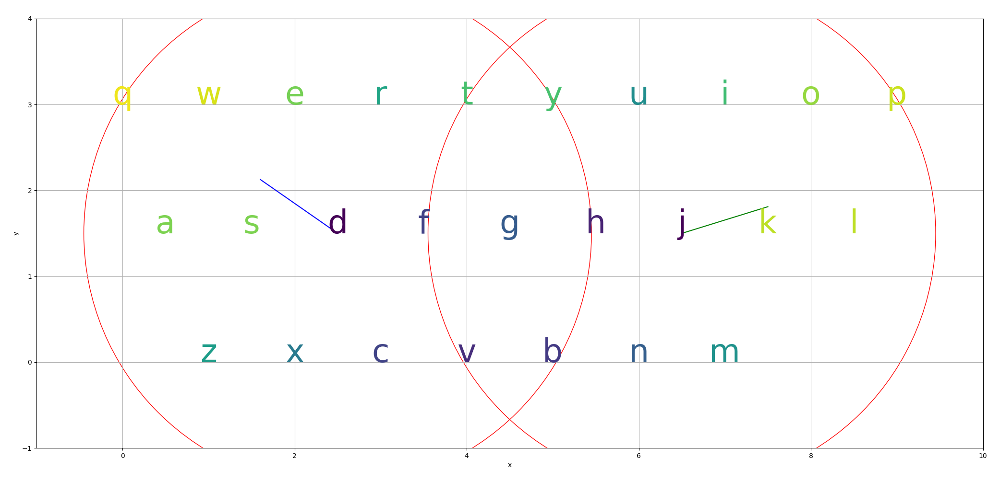
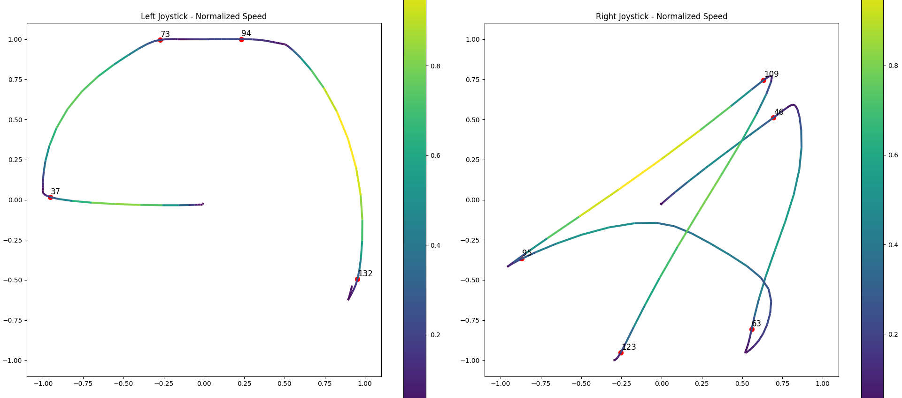

# Joyspeak

Joyspeak is a gesture-based assistive text input system. In other words, typing using an Xbox controller...

## Motivation for Accessibility
<table>
  <tr>
    <th>Speech</th>
    <th>Visual</th>
    <th>Motor</th>
  </tr>
  <tr>
    <td>If text input is too slow for text-to-speech, it can hinder real-time communication, causing lack of engagement and frustration.</td>
    <td>Typing or texting can be visually demanding, impacting those with vision impairments or those who need to multitask.</td>
    <td>Many text input methods require fine motor control and dexterity, which can be a barrier for some individuals.</td>
  </tr>
</table>

## Mission
> Joyspeak aims to reduce the physical, visual, and cognitive load required to communicate.
> Speech is most effective in this regard, and Joyspeak aims to come second.

## Design
Let's examine how it works when a user tries to type the word **"something"**:
1. **Mapping Direction to Keys**: We first map the direction of each joystick to the probability of each key being typed:

   

2. **Extracting Points of Interest**: Then, given a recording of a joystick input path, we extract points of interest using velocity:

   

3. **Constructing Words**: Then we construct words using direction mapping of the points and traversal of a dictionary trie:

   ```
    INFO:root:[{'prefix': 'a', 'score': -0.013898004975586162}, {'prefix': 's', 'score': -0.013898004975586162}, {'prefix': 'aa', 'score': -0.013898004975586162}]
    INFO:root:[{'prefix': 'ap', 'score': -0.06589595697202899}, {'prefix': 'app', 'score': -0.06589595697202899}, {'prefix': 'sp', 'score': -0.06589595697202899}]
    INFO:root:[{'prefix': 'som', 'score': -0.1859767493180921}, {'prefix': 'aim', 'score': -0.3544261872275795}, {'prefix': 'sim', 'score': -0.3544261872275795}]
    INFO:root:[{'prefix': 'some', 'score': -0.20862849277780812}, {'prefix': 'aime', 'score': -0.3770779306872955}, {'prefix': 'apple', 'score': -0.4616449088231093}]
    INFO:root:[{'prefix': 'somer', 'score': -0.244352644152514}, {'prefix': 'some', 'score': -0.4058217089349089}, {'prefix': 'somet', 'score': -0.40942177718737893}]
    INFO:root:[{'prefix': 'someb', 'score': -0.546264392489774}, {'prefix': 'someh', 'score': -0.5517002550077779}, {'prefix': 'someth', 'score': -0.5553003232602479}]
    INFO:root:[{'prefix': 'somebo', 'score': -0.5789013830461069}, {'prefix': 'someho', 'score': -0.5843372455641108}, {'prefix': 'somethi', 'score': -0.6917672824491028}]
    INFO:root:[{'prefix': 'somethin', 'score': -0.7173861044159764}, {'prefix': 'sometim', 'score': -1.1187885877713082}, {'prefix': 'sportin', 'score': -1.662487351238229}]
    INFO:root:[{'prefix': 'something', 'score': -0.8879903806806595}, {'prefix': 'sporting', 'score': -1.833091627502912}, {'prefix': 'skating', 'score': -2.074302420700737}]
   ```

## Limitations
- The current implementation cannot recognize words like "people", where consecutive letters do not change much in direction.
- The design isn't robust towards slight mistimings between joysticks, leading the prefix search down the wrong path.
- Current parameters are tuned based on my swiping style.

## Future work
- Explore more robust approaches using sequential Machine Learning algorithms like RRN with CTC.
  Check out this [blog post](https://ai.googleblog.com/2017/05/the-machine-intelligence-behind-gboard.html) to understand how Google's gesture typing algorithm works
- Use the spatial model in conjuction with a language model to select words given prior context

